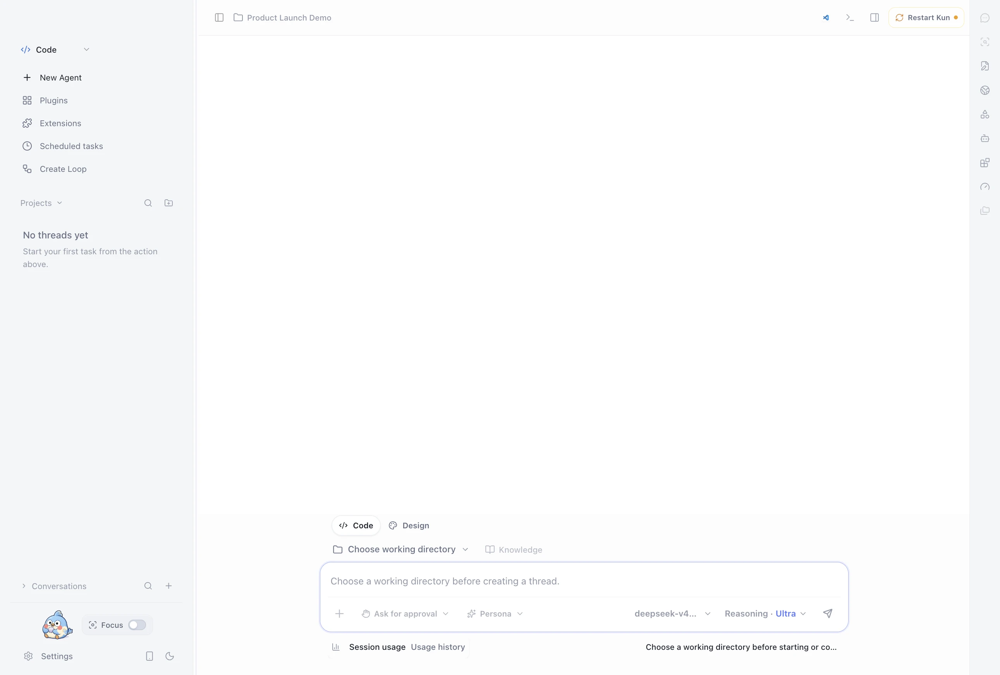
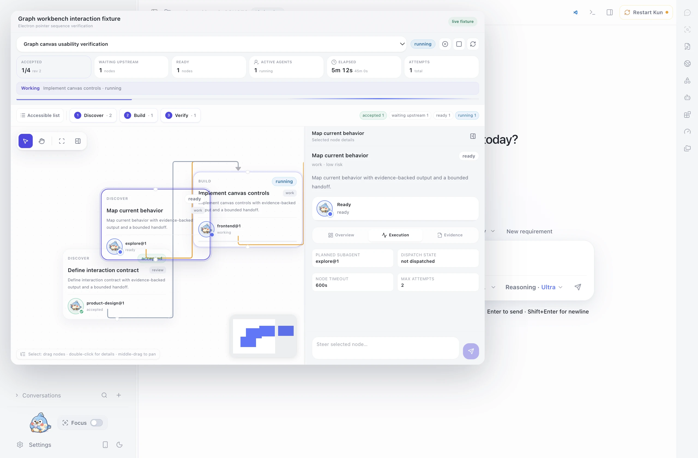
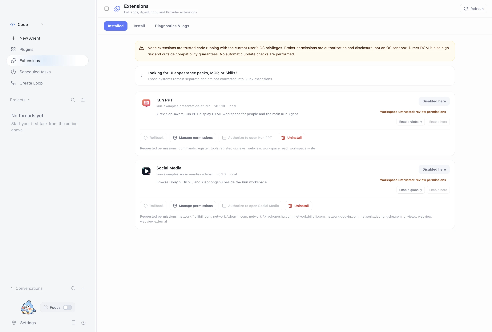
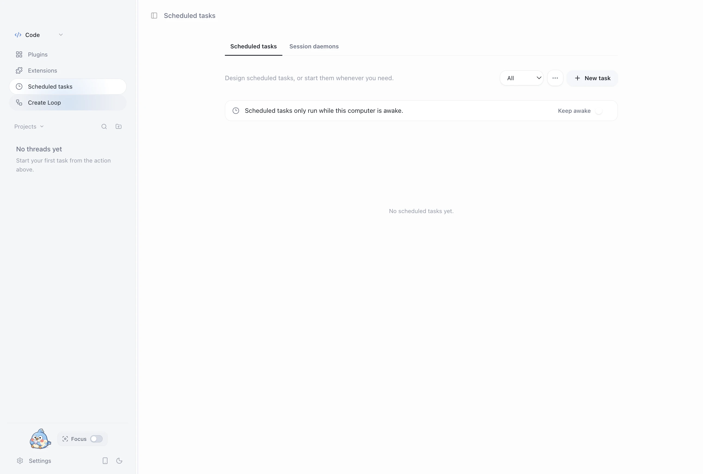

<p align="center">
  
</p>

<h1 align="center">Kun — 本地优先的 AI Agent 工作台</h1>

<p align="center">
  让 AI 在真实项目中规划、执行、验证并交付。<br>
  桌面 GUI 与终端 TUI 共用同一个本地运行时，任务、审批、计划和证据始终连续。
</p>

<p align="center">
  <a href="https://github.com/KunAgent/Kun/releases">下载桌面版</a>
  &nbsp;·&nbsp;
  <a href="https://www.kun-agent.com/docs">阅读文档</a>
  &nbsp;·&nbsp;
  <a href="https://github.com/KunAgent/Kun">GitHub</a>
  &nbsp;·&nbsp;
  <a href="./README.en.md">English</a>
</p>

<p align="center">
  <a href="https://github.com/KunAgent/Kun/releases"></a>
  <a href="./LICENSE"></a>
  
  
</p>

<p align="center">
  
</p>

## Kun 是什么

Kun 是把 AI 从“回答问题”推进到“完成工作”的本地优先工作台。它围绕真实工作区组织 Code、Design、Write、研究和自动化：Agent 可以读取项目上下文、制定计划、调用工具、修改文件、运行验证，并把证据留在任务旁。

桌面 GUI 适合观察、审阅和控制过程；终端 TUI 适合专注于键盘工作。两者通过同一个本地 `kun serve` 运行时共享线程、目标、计划、审批和后台任务，而不是两套彼此割裂的会话。

## 一眼了解

| 你需要 | Kun 提供 |
| --- | --- |
| 在代码库中交付改动 | Code 工作台、项目上下文、文件编辑、终端、Git / Worktree、Diff、测试和审查。 |
| 从需求走到方案 | 在同一 Code 会话中切换 Design 任务，沉淀原型、设计系统、画布和 Design → Code 上下文。 |
| 处理文档与资料 | Write 工作区可编辑 Markdown/TXT，并可只读预览、引用和分析 PDF、Word、Excel、PowerPoint。 |
| 让复杂任务分工 | Direct 模式完成聚焦任务；实验性的 Agent Graph 用依赖、子代理、监督和验收管理多阶段工作。 |
| 自动化重复流程 | Scheduled tasks、Loops、Hooks、MCP、Skills 与可安装扩展。 |
| 选择模型和接入方式 | 订阅、计划、API、OpenAI / Anthropic 兼容服务与自托管模型均可通过 Provider 配置接入。 |

## 当前界面

以下截图均在一次性隔离的应用配置和空白演示工作区中重新采集。截图内没有真实项目、账户信息、个人设置或会话记录。

<p align="center">
  
</p>

<p align="center">
  
</p>

<p align="center">
  
</p>

<p align="center">
  
</p>

## 从目标到验收

```text
澄清目标 → 形成计划 → 执行与协作 → 检查证据 → 交付或继续
```

1. **给出目标和约束。** Agent 结合项目内容补足范围、风险和验收标准。
2. **选择合适的执行方式。** 使用 Direct 快速完成单点任务；跨文件、跨阶段工作可交给 Agent Graph。
3. **在可见的上下文中执行。** 计划、Todo、工具调用、文件改动、浏览器/终端结果和审批都关联到任务。
4. **以证据完成交付。** 回看 Diff、测试、审查和产物；需求变化后可以继续、分叉、归档或重新规划。

需求和计划默认可以保存在项目中，因此能进入版本控制、代码审查和后续恢复流程。

## Agent Graph：为复杂工作建立可靠分工

Agent Graph 面向具有明确依赖和验收标准的复杂任务。Lead Agent 负责拆分任务图、派发受限子代理、跟踪进度、要求证据并在关键节点验收；它不是第二个运行时，也不会扩大权限。

- 子代理只能使用父任务授权范围内的文件、工具、网络、Skills 和 MCP。
- 节点只有在完成实际检查并被明确接受后才会交接给下游。
- 任务图可暂停、恢复、重试、修改或停止，历史活动不会被伪装为成功。

详细模型、边界与恢复机制见 [Agent Graph 文档](docs/graph-mode.md)。

## 本地优先，不等于永不联网

会话、偏好、日志和运行时数据默认保存在本机。选择云端模型后，提示、附件和任务上下文会发送给所选 Provider；使用前请确认该服务的数据政策。工具权限、敏感操作和扩展权限会在界面中明确呈现，仍由你决定是否授权。

Kun 不绑定单一模型。预设覆盖 ChatGPT / Codex、Claude、Gemini、Cursor、Ollama、DeepSeek、Kimi、GLM、Qwen、MiniMax 和 Xiaomi MiMo 等生态；登录方式、模型、地区与额度取决于当前版本和 Provider 规则。请查看 [模型 Provider 文档](docs/model-provider-presets.md) 了解配置方式。

## 5 分钟开始

从 [GitHub Releases](https://github.com/KunAgent/Kun/releases) 下载当前版本：

| 平台 | 安装包 | 架构 |
| --- | --- | --- |
| macOS | `.dmg` / `.zip` | Apple Silicon / Intel |
| Windows | `.exe` | x64 |
| Linux | `.AppImage` / `.deb` | x64 |

启动后：

1. 选择语言并配置一个模型订阅、计划、API 或自定义 Provider。
2. 打开本地项目或创建工作区。
3. 发送一个目标明确、范围有限、可以验证的任务。

桌面版和 TUI 可同时连接同一个运行时。在项目目录中运行：

```bash
kun
```

也可从 Release 下载独立 TUI；更多命令和配置见 [Kun TUI 文档](docs/kun-tui.md)。

## 从源码运行

要求：Node.js 22.19+、npm，以及至少一个可用的模型连接。

```bash
git clone https://github.com/KunAgent/Kun.git
cd Kun
npm ci
npm run dev
```

| 命令 | 用途 |
| --- | --- |
| `npm run dev` | 构建运行时并启动 Electron 开发环境 |
| `npm run dev:tui` | 构建运行时并启动终端 TUI |
| `npm run typecheck` | TypeScript 类型检查 |
| `npm run lint` | 运行 ESLint 与文件大小检查 |
| `npm run test` | 运行测试 |
| `npm run build` | 生产构建 |
| `npm run dist:mac` / `dist:win` / `dist:linux` | 构建对应平台安装包 |

中国大陆网络访问较慢时可使用 npm 镜像：

```bash
npm ci --registry=https://registry.npmmirror.com
```

## 文档与贡献

| 主题 | 文档 |
| --- | --- |
| TUI、命令和运行时 | [docs/kun-tui.md](docs/kun-tui.md) / [kun/README.zh-CN.md](kun/README.zh-CN.md) |
| Agent Graph | [docs/graph-mode.md](docs/graph-mode.md) |
| Design 工作流 | [docs/DESIGN_MODE.md](docs/DESIGN_MODE.md) |
| Loops、MCP 与 Skills | [docs/workflow-loop.md](docs/workflow-loop.md) / [docs/project-mcp-skills.md](docs/project-mcp-skills.md) |
| Extension 平台 | [docs/extensions/README.md](docs/extensions/README.md) |
| 本地开发 | [docs/DEVELOPMENT.zh-CN.md](docs/DEVELOPMENT.zh-CN.md) |

欢迎贡献 bug 修复、UI/UX、运行时、Provider、扩展和文档。日常集成分支为 `develop`，PR 请以 `develop` 为目标分支；开始前阅读 [贡献指南](docs/CONTRIBUTING.zh-CN.md)，外部贡献需要接受 [CLA](./CLA.md)。

## 许可证

Kun 使用 [PolyForm Noncommercial License 1.0.0](./LICENSE)，仅供学习、研究和非商业用途。商业使用、商业分发、SaaS / 托管服务、转售或集成到商业产品中，需要获得作者的单独书面授权。

## 致谢

感谢所有提交 issue、建议、代码和文档的贡献者。

<a href="https://github.com/KunAgent/Kun/graphs/contributors">
  
</a>
